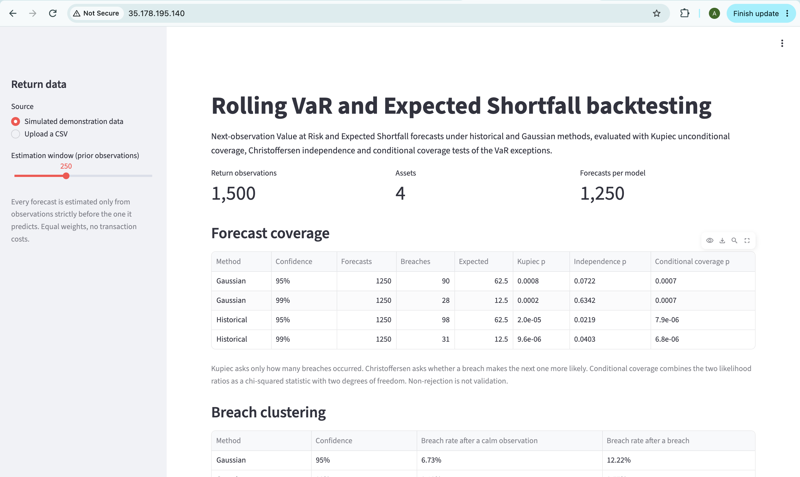

# Market Risk Analytics: Forecasts, Coverage & Stress

[](https://github.com/ajayworks/market-risk-analytics/actions/workflows/ci.yml)

A Python portfolio-risk study that compares historical and Gaussian VaR forecasts using only previously observed returns, quantifies Expected Shortfall, and tests not just how often the models fail but **when**.

**Start here:** [live app](https://market-risk-backtesting.streamlit.app) · [results and chart](results/RESULTS.md) · [forecast code](risk.py) · [regression tests](tests/test_risk.py).

## Main finding

Across **1,517 next-observation forecasts**, 99% historical VaR had **28 breaches** and Gaussian VaR had **34**, against **15.17 expected**. Kupiec unconditional-coverage p-values were **0.0031** and **2.9e-05**.

The more informative result is *when* those breaches arrived:

| Model | breach rate after a calm observation | after a breach | conditional coverage p |
|---|---:|---:|---:|
| Historical 99% | 1.48% | **21.43%** | 3.8e-07 |
| Gaussian 99% | 1.82% | **20.59%** | 4.3e-09 |
| Historical 95% | 4.81% | **16.05%** | 0.0011 |
| Gaussian 95% | 4.81% | **15.00%** | 0.0034 |

Following a calm observation, the historical 99% model breaches 1.48% of the time — close to its 1% target. Following a breach, it breaches 21.4% of the time. Christoffersen's independence test rejects for **all four** models, and so does conditional coverage — **including the two 95% models that pass Kupiec comfortably** (p = 0.55 and 0.47).

The models do not merely breach too often. They breach in bursts, and the standard unconditional test cannot see it. A 250-observation rolling window adapts to a volatility regime only after that regime has already produced losses.

This replaces the original notebook's in-sample PASS labels with a chronological forecast evaluation.


## Implemented

- Historical and Gaussian VaR/Expected Shortfall at 95% and 99%, with a rolling 250-observation training window.
- Explicit training start/end dates per forecast; the realised observation and all future observations are excluded from estimation, enforced by a regression test that corrupts future data and asserts past forecasts are unchanged.
- Kupiec unconditional coverage, Christoffersen independence, and conditional coverage, plus exact binomial diagnostics, with stable handling of zero or all breaches.
- Equal-weight portfolio aggregation and component contributions to volatility.
- Seeded 10,000-scenario multivariate Gaussian Monte Carlo estimates (descriptive, not forecast backtests).
- Three explicit hypothetical stress scenarios with per-asset shock assumptions.
- Machine-readable forecast, metric and provenance outputs plus a reviewer-facing chart.

## Reproducibility

The coverage results reproduce **byte-identically** on a second environment — Linux / Python 3.10 / NumPy 2.2.6 against macOS / Python 3.12 / NumPy 2.4.0. Both manifests and the reproduced coverage table are committed under [results/reproduction/](results/reproduction/) so the comparison can be checked rather than taken on trust. Monte Carlo estimates agree to fifteen significant figures, differing in the final bits at the 95% level through floating-point summation order in the portfolio aggregation; they are descriptive and excluded from the forecast evaluation. `results/run_manifest.json` records the input SHA-256, the Python version and the installed library versions of the run that produced the published figures.

Monte Carlo draws use an explicit Cholesky decomposition. NumPy's default multivariate-normal method is SVD, whose singular vectors are defined only up to sign, so two correct LAPACK builds return different decompositions and the same seed produces different draws. Monte Carlo values published before this change were not reproducible across environments; the coverage results always were.

## Run

Verified with Python 3.12.2. From the repository root:

```bash
python -m venv .venv
source .venv/bin/activate
python -m pip install -r requirements.txt
python -m unittest discover -s tests -v
python risk.py
```

The return snapshot is excluded from version control, so a fresh clone will not contain it. `python fetch_data.py` downloads a replacement, but vendor adjustments and calendar changes mean a fresh download will **not** reproduce the published figures exactly — the SHA-256 of the exact input used is in the manifest. See [data provenance](data/raw/README.md). Unit tests use generated data and need no download.

Alternative input:

```bash
python risk.py --data data/raw/refreshed_returns.csv --output results/refreshed
```

Input is a CSV with a date column first and numeric simple-return columns, with strictly increasing unique dates and no missing values. Defaults are equal long-only weights; changing the asset set disables the four-asset-specific stress scenarios.

## Browser interface

**[market-risk-backtesting.streamlit.app](https://market-risk-backtesting.streamlit.app)** — free hosting, so the app sleeps after a spell without visitors and takes about half a minute to wake.

`app.py` is a Streamlit interface over the same functions in `risk.py` that the regression tests cover. It recomputes nothing of its own, so the browser and the command line cannot drift apart and report different numbers for the same input. It takes either an uploaded return CSV or a simulated series generated from a GARCH-like process, and both paths go through `load_returns`, so the demonstration cannot bypass a validation check that real data has to pass.

**The simulated series is a demonstration and is not evidence about any market.** The figures above come from the dataset described under [data provenance](data/raw/README.md).

Locally:

```bash
python -m streamlit run app.py
```

In a container:

```bash
docker build -t market-risk-analytics .
docker run -p 8080:8080 market-risk-analytics
```

The image installs the pinned `requirements.txt`, copies only `risk.py` and `app.py`, runs as a non-root user and serves Streamlit on port 8080.

## Deployment

The container in the section above is what runs on AWS. On an EC2 instance (Amazon Linux 2023, t3.micro, eu-west-2) the image is built from this repository and started as a background service:

```bash
sudo docker build -t market-risk-analytics .
sudo docker run -d --restart unless-stopped -p 80:8080 --name market-risk market-risk-analytics
```

`--restart unless-stopped` brings the container back after a crash or an instance reboot; the `HEALTHCHECK` in the `Dockerfile` polls Streamlit's own `/_stcore/health` endpoint, so `docker ps` reports whether the application inside is alive rather than merely whether the process exists.



Recorded 21 September 2026 at `http://35.178.195.140`. Two honest notes on that screenshot. The instance runs on a time-limited AWS account, so the address will stop resolving; this screenshot and description are the durable record, and [market-risk-backtesting.streamlit.app](https://market-risk-backtesting.streamlit.app) is the permanent link. And it is served over plain HTTP — no TLS certificate was configured for a demonstration deployment, which is why the browser marks it *Not Secure*.

The figures are identical, to every digit displayed, across local macOS (NumPy 1.26.4), Streamlit Community Cloud and the EC2 container (both Python 3.12 / NumPy 2.4.0): 1,250 forecasts per model and 90, 28, 98 and 31 breaches. That is a consequence of the design rather than a coincidence — the interface carries no arithmetic of its own, so every environment is running the same tested functions in `risk.py`.

## Method

At each forecast date t, estimate VaR and ES from observations t-250 through t-1. A breach occurs when realised loss (-return) exceeds the forecast VaR. Historical ES is the empirical mean of sample losses at or above the interpolated VaR threshold. Gaussian ES uses the normal tail expectation. Full-sample descriptive calculations are never used in these forecasts.

Kupiec compares the breach count with the target rate. Christoffersen compares the breach probability following a breach with the probability following a calm observation; the two likelihood ratios are additive and give conditional coverage as a chi-squared statistic with two degrees of freedom.

Portfolio weights are reset to 25% in each exposure each observation. Risk contributions use Euler decomposition of covariance-based volatility, with a 252 annualisation factor. The Monte Carlo seed is 42.

## Limitations

- The source dataset aligns markets on common dates; some returns span more than one market session. The forecast horizon is the next aligned observation, not always exactly one trading day.
- FTSE returns and US asset returns are combined without currency conversion. This is an illustrative normalised-return portfolio, not a fully specified investable portfolio in one currency. There are no transaction or financing costs.
- At 99% the historical ES estimate averages only the three largest losses in each 250-observation window, so it is very noisy. No ES backtest is performed or claimed.
- Eight tests are reported across four models. At a 5% level with four conditional-coverage tests, a Bonferroni threshold is 0.0125; all four conditional-coverage p-values fall below it, so the conclusion does not depend on the correction. Individual p-values should still not be read in isolation.
- Christoffersen's independence test considers only first-order transitions. It would not detect longer-memory dependence, and it has the usual Type I error rate — an independent breach sequence rejects at 5% about one time in twenty.
- Gaussian simulations assume a multivariate normal distribution; the tail-coverage failures are part of the findings.
- Hypothetical stress shocks are hand-specified; they are not regulatory stress scenarios or probability forecasts.
- The data snapshot ends on 5 March 2026. This is a historical study, not a current market-risk report.

## Project progression

The archived academic notebook is retained in `notebooks/` with a prominent correction notice. It includes volatility, correlation, covariance and introductory VaR calculations. The maintained CLI and test suite supersede its in-sample coverage interpretation.

Prepared from Ajay Singh's original project with AI assistance for refactoring, chronological validation, tests and documentation. Newly generated results are separated from archived notebook outputs.