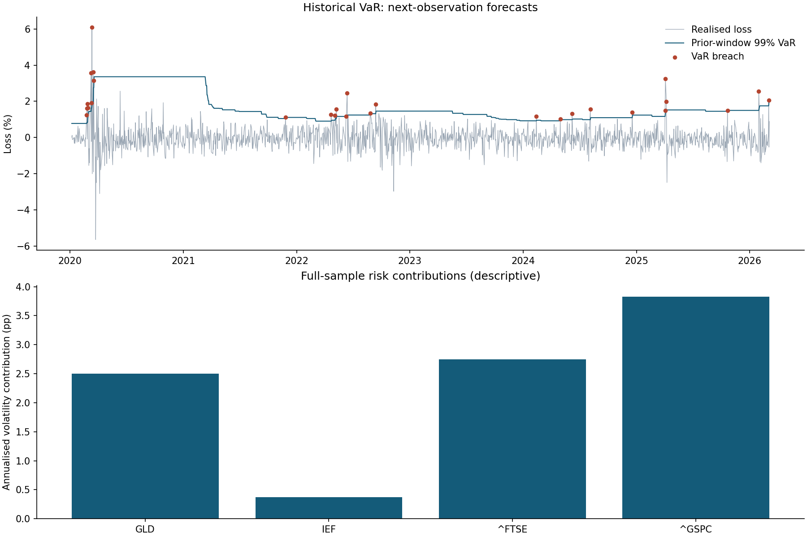

# Market Risk Analytics: results

Input: 2019-01-03 to 2026-03-05; 1,767 return observations; 250 prior observations per forecast.

## Forecast coverage

| Method | Confidence | Forecasts | Breaches | Expected | Kupiec p | Independence p | Conditional coverage p |
|---|---:|---:|---:|---:|---:|---:|---:|
| Gaussian | 95% | 1517 | 81 | 75.9 | 0.5483 | 0.0009 | 0.0034 |
| Gaussian | 99% | 1517 | 34 | 15.2 | 2.9e-05 | 4.4e-06 | 4.3e-09 |
| Historical | 95% | 1517 | 82 | 75.9 | 0.4743 | 0.0003 | 0.0011 |
| Historical | 99% | 1517 | 28 | 15.2 | 0.0031 | 5.0e-06 | 3.8e-07 |

## Breach clustering

| Method | Confidence | Breach rate after a calm observation | Breach rate after a breach |
|---|---:|---:|---:|
| Gaussian | 95% | 4.81% | 15.00% |
| Gaussian | 99% | 1.82% | 20.59% |
| Historical | 95% | 4.81% | 16.05% |
| Historical | 99% | 1.48% | 21.43% |

Each forecast excludes the realised observation and all future data. Kupiec tests only how many breaches occurred; the Christoffersen independence test asks whether a breach makes the next breach more likely; conditional coverage combines the two as a chi-squared statistic with two degrees of freedom. Non-rejection is not validation, and none of these tests establishes Expected Shortfall adequacy: at 99% the historical ES estimate averages only the three largest losses in each 250-observation window.

## Hypothetical stress scenarios

| Scenario | Portfolio return |
|---|---:|
| Equity sell-off | -7.50% |
| Rates and inflation shock | -8.75% |
| Broad liquidation | -13.00% |

Shocks are explicitly chosen illustrations, not historical estimates or regulatory scenarios. Exact per-asset assumptions are in stress_scenarios.json.

## Scope

Equal weights are reset each observation; no transaction costs. Returns are from the original common-date dataset. Cross-market holiday alignment can make an observation span more than one trading day. FTSE and US assets are used as normalised local-return exposures without FX conversion, so this is not a fully specified single-currency investable portfolio. Full-sample covariance, risk contributions and Monte Carlo estimates are descriptive and are excluded from forecast evaluation.
